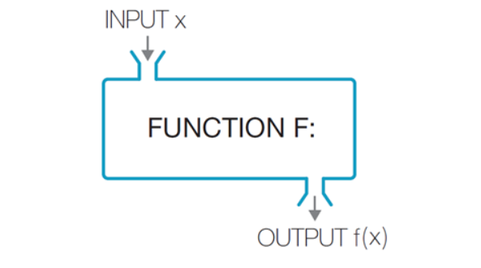

# SQL

## 내장함수

#### SQL내장함수

- SQL에서는 *함수의 개념*을 사용한다.

- SQL의 함수는**DBMS**가 제공하는 내장 함수(built-in function)

- 사용자가 필요에 따라 **직접 만드는** 사용자 정의 함수(user-defined function)

- SQL 내장 함수는 상수나 속성 이름을 입력 값으로 받아 단일 값을 결과로 반환한다.

- 모든 내장 함수는 최초에 선언될 때 유효한 입력 값을 받아야한다.

  

- MySQL에서 사용하는 숫자 함수

| 함수                           | 설명                                                         |
| ------------------------------ | ------------------------------------------------------------ |
| **ABS(****숫자****)**          | 숫자의 절댓값을 계산   ABS(-4.5) => 4.5                      |
| **CEIL(****숫자****)**         | 숫자보다 크거나 같은 최소의 정수   CEIL(4.1) => 5            |
| **FLOOR(****숫자****)**        | 숫자보다 작거나 같은 최소의 정수   FLOOR(4.1) => 4           |
| **ROUND(****숫자****,** **m)** | 숫자의 반올림,  m은 반올림 기준 자릿수  ROUND(5.36, 1) => 5.40 |
| **LOG(n,** **숫자****)**       | 숫자의 자연로그 값을 반환  LOG(10) => 2.30259                |
| **POWER(****숫자****,** **n)** | 숫자의 n제곱 값을 계산  POWER(2, 3) => 8                     |
| **SQRT(****숫자****)**         | 숫자의 제곱근 값을 계산(숫자는 양수)  SQRT(9.0) => 3.0       |
| **SIGN(****숫자****)**         | 숫자가 음수면 -1, 0이면 0, 양수면 1  SIGN(3.45) => 1         |

| **질의** **4-3**  **고객별  평균 주문 금액을 백 원 단위로 반올림한 값을 구하시오****.** |
| ------------------------------------------------------------ |
| SELECT   custid  ‘고객번호’,  ROUND(SUM(saleprice)/COUNT(*),  -2) ‘평균금액’  FROM   Orders  GROUP  BY custid; |

- MySQL에서 사용하는 문자함수의 종류

  문자값 반환 함수

  s:문자열, c:문자, n:정수, k:정수

| 함수                      | 설명                                                         |
| ------------------------- | ------------------------------------------------------------ |
| **CONCAT(s1,s2)**         | 두 문자열을 연결, CONCAT('마당', ' 서점')  => '마당 서점'    |
| **LOWER(s)**              | 대상 문자열을 모두 소문자로 변환, LOWER('MR. SCOTT') => 'mr.  scott' |
| **LPAD(****s,n,c****)**   | 대상 문자열의 왼쪽부터 지정한 자리수까지 지정한 문자로 채움  LPAD('Page 1', 10, '*') =>  '****Page 1' |
| **REPLACE(s1,s2,s3)**     | 대상 문자열의 지정한 문자를 원하는 문자로 변경  REPLACE('JACK & JUE', 'J',  'BL') => 'BLACK & BLUE' |
| **RPAD(****s,n,c****)**   | 대상 문자열의 오른쪽부터 지정한 자리수까지 지정한 문자로 채움  RPAD('AbC', 5, '*') => 'AbC**' |
| **SUBSTR(****s,n,k****)** | 대상 문자열의 지정된 자리에서부터 지정된 길이만큼 잘라서 반환  SUBSTR('ABCDEFG', 3, 4) =>  'CDEF' |
| **TRIM(c FROM s)**        | 대상 문자열의 양쪽에서 지정된 문자를 삭제(문자열만  넣으면 기본값으로 공백 제거)  TRIM('=' FROM '==BROWNING==')  => 'BROWNING' |
| **UPPER(s)**              | 대상 문자열을 모두 대문자로 변환  UPPER('mr.  scott') => 'MR. SCOTT' |

숫자값 반환 함수

| **ASCII(c)**       | 대상 알파벳 문자의 아스키 코드 값을 반환, ASCII('D') => 68   |
| ------------------ | ------------------------------------------------------------ |
| **LENGTH(s)**      | 대상 문자열의 Byte  반환,  알파벳 1byte,  한글 3byte  (UTF8)  LENGTH('CANDIDE') => 7 |
| **CHAR_LENGTH(s)** | 문자열의 문자 수를 반환, CHAR_LENGTH('데이터')  => 3         |

- 날짜 시간 함수

  | 함수                              | 반환형  | 설명                                                         |
  | --------------------------------- | ------- | ------------------------------------------------------------ |
  | **STR_TO_DATE(string, format) )** | DATE    | 문자열(STRING) 데이터를 날자형(DATE)으로 반환  STR_TO_DATE('2019-02-14',  '%Y-%m-%d') => 2019-02-14 |
  | **DATE_FORMAT(date, format)**     | STRING  | 날짜형(DATE) 데이터를 문자열(VARCHAR)로 반환  DATE_FORMAT('2019-02-14',  '%Y-%m-%d') => '2019-02-14' |
  | **ADDDATE(date, interval)**       | DATE    | DATE 형의 날짜에서 INTERVAL 지정한 시간만큼 더함  ADDDATE('2019-02-14', INTERVAL 10  DAY) => 2019-02-24 |
  | **DATE(date)**                    | DATE    | DATE 형의 날짜 부분을 반환  SELECT DATE('2003-12-31  01:02:03');  =>  2003-12-31 |
  | **DATEDIFF(date1, date2)**        | INTEGER | DATE 형의 date1 – date2 날짜 차이를 반환  SELECT DATEDIFF('2019-02-14',  '2019-02-04') => 10 |
  | **SYSDATE**                       | DATE    | DBMS 시스템상의 오늘 날짜를 반환하는 함수  SYSDATE() => 2018-06-30 21:47:01 |

- 날짜 format주용 지정자

  

| 인자       | 설명                        |
| ---------- | --------------------------- |
| **%w**     | 요일 순서(0~6,  Sunday=0)   |
| **%W**     | 요일(Sunday~Saturday)       |
| **%a**     | 요일의 약자(Sun~Sat)        |
| **%d**     | 1달  중 날짜(00~31)         |
| **%j**     | 1년  중 날짜(001~366)       |
| **%h**     | 12시간(01~12)               |
| **%H**     | 24시간(00~23)               |
| **%****i** | 분(0~59)                    |
| **%m**     | 월 순서(01~12,  January=01) |
| **%b**     | 월 이름 약어(Jan~Dec)       |
| **%M**     | 월 이름(January~December)   |
| **%s**     | 초(0~59)                    |
| **%Y**     | 4자리  연도                 |
| **%y**     | 4자리  연도의 마지막 2 자리 |