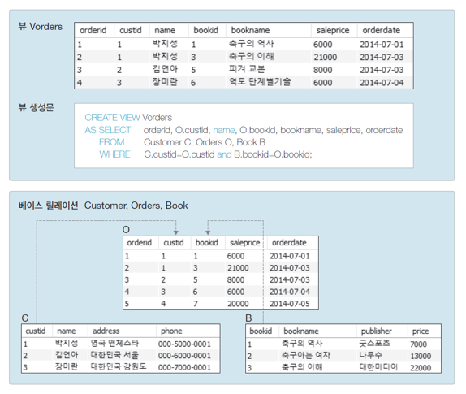
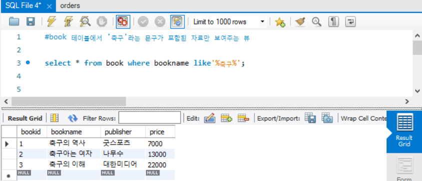
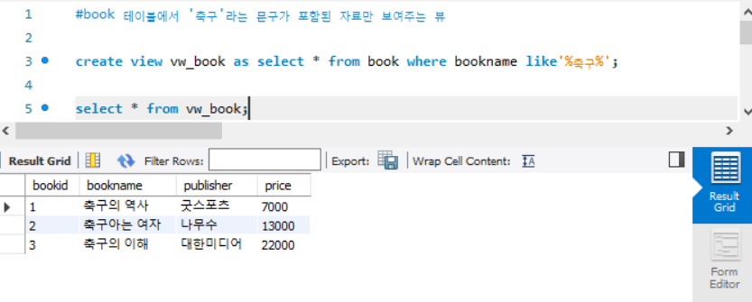
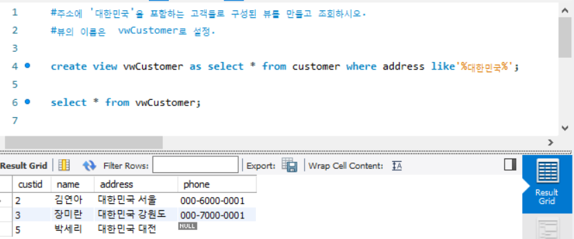
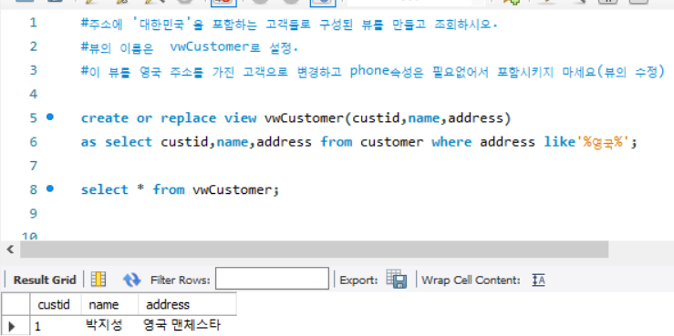
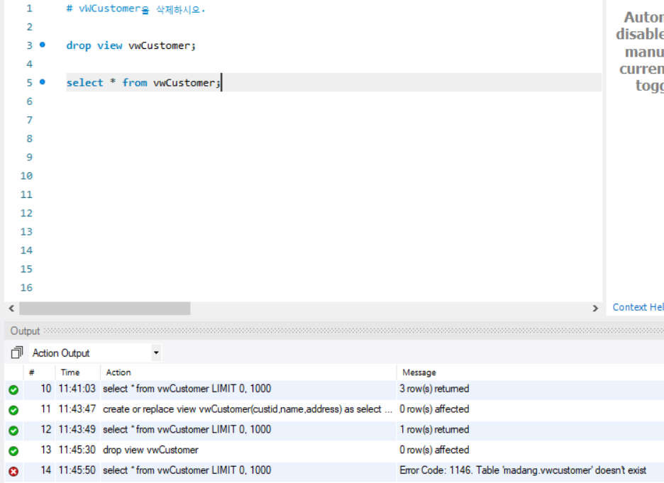

---
<<<<<<< HEAD
title: SQLview
=======
title: SQL고급(view)
>>>>>>> origin/master
categories:[MySQL]
comments: true
---

# SQL고급

## 뷰(view)

: 하나 이상의 테이블을 합하여 만든 가상의 테이블

---------------------

#### 뷰의 장점

- **편리성 및 재사용성**: 

  자주 사용되는 복잡한 질의를 뷰로 미리 정의해 놓을 수 있음

- **보완성**:

   사용자 별로 필요한 데이터만 선별하여 보여줄 수 있고, 중요한 질의의 경우 질의 내용을 암호화할 수 있음.

- **독립성**:

   미리 정의된 뷰를 일반 테이블처럼 사용할 수 있긴 때문에 편리하고, 사용자가 필요한 정보만 요구에 맞게 가공하여 뷰로 만들어 쓸 수 있음.

  -------------------------------

  

#### 뷰의 특징

- 원본 데이터 값에 따라 같이 변함.

- 독립적인 인덱스 생성이 어려움.

- 삽입, 삭제, 갱신 연산에 많은 제약이 따름.

  ---------------------------

  

--------------------------------------

#### 기본 문법

##### 	뷰의 생성

​						create **view** 뷰이름[(열이름[,...n])] as select 문

##### 	뷰의 수정

​						create **of replace view** 뷰이름[(열이름[,...n])] as select 문

##### 	뷰의 삭제

​						**drop view** 뷰이름[,...n]; 

---------------

##### 실습 및 연습문제

