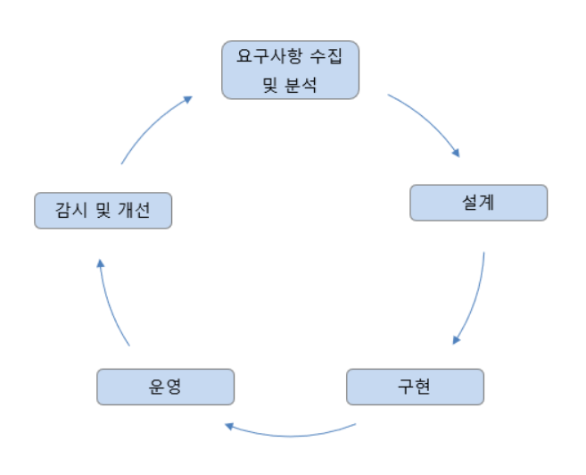
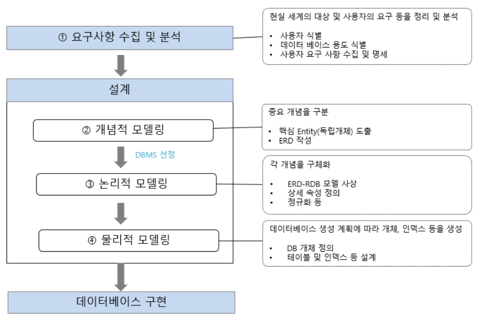
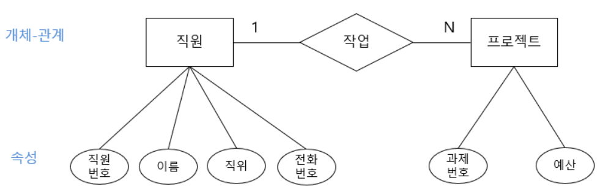
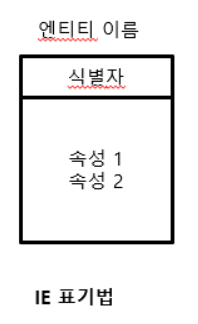

# SQL

## 데이터모델링

-------------

### 데이터모델링의 개념

#### 데이터베이스생명주기

**database life cycle**

:**데이터베이스의 생성과 운영에 관련된 특징**

1.요구사항 수집 및 분석

사용자들의 요구사항을 듣고 분석하여 데이터베이스 구축의 범위를 정함

2.설계

분석된 요구사항을 기초로 주요 개념과 업무 프로세스 등을 식별하고(개념적 설계), 사용하는 DBMS의 종류에 맞게 변환(논리적 설계)한 후, 데이터베이스 스키마를 도출(물리적 설계)함

3.구현

설계 단계에서 생성한 스키마를 실제 DBMS에 적용하여 테이블 및 관련 객체(뷰, 인덱스 등)를 만듦

4.운영

구현된 데이터베이스를 기반으로 소프트웨어를 구축하여 서비스를 제공함

5.감시 및 개선

데이터베이스 운영에 따른 시스템의 문제를 관찰하고 데이터베이스 자체의 문제점을 파악하여 개선함

#### 데이터 모델링 과정

##### 개념적 모델링

- 요구사항을 수집하고 분석한 결과를 토대로 업무의 핵심적인 개념을 구분하고 전체적인 뼈대를 만드는 과정

- **개체**(entity)를 추출하고 각 개체들 간의 관계를 정의하여 **ER** **다이어그램**(ERD, Entity Relationship Diagram)을 만드는 과정까지를 말함

##### 논리적 모델링

- **개념적 모델링에서 만든** **ER** **다이어그램을 사용하려는**DBMS에 맞게 사상(매핑, mapping)하여 실제 데이터베이스로 구현하기 위한 모델을 만드는 과정

- 논리적 모델링 과정

  - 개념적 모델링에서 추출하지 않았던 상세 속성들을 모두 추출

  - 정규화 수행

  - 데이터 표준화 수행

    

##### 물리적 모델링

- **작성된 논리적 모델을 실제 컴퓨터의 저장 장치에 저장하기 위한 물리적 구조를  정의하고 구현하는 과정**
- **DBMS** **특성에 맞게 저장 구조를 정의해야 데이터베이스가 최적의 성능을 낼 수 있음**
- 트랜잭션, 저장 공간 설계 측면에서 고려할 사항
  - 응답시간을 최소화 해야한다.
  - 얼마나 많은 트랜잭션을 동시에 발생시킬 수 있는지 검토해야한다.
  - 데이터가 저장될 공간을 효율적으로 배치해야 한다.

###### 트랜잭션(transaction)이란 "**쪼갤 수 없는 업무 처리의 최소 단위**"를 말한다.

------------------

### ER모델

- **ER(Entity Relationship)** **모델**
  - 세상의 사물을 개체(entity)와 개체 간의 관계(relationship)로 표현함

- **개체**

  - 독립적인 의미를 지니고 있는 유무형의 사람 또는 사물
  - 개체의 특성을 나타내는 속성(attribute)에 의해 식별됨. 개체끼리 서로 관계를 가짐

- ER 다이어 그램

  - ER모델은 개체와 개체 간의 관계를 표준화된 그림을 나타낸다.

    
    

#### 개체와 개체타입

- **개체**(entity)란?
  - 사람, 사물, 장소, 개념, 사건과 같이 유무형의 정보를 가지고 있는 독립적인 실체
  - 데이터베이스에서 주로 다루는 개체는 낱개로 구성된 것, 낱개가 각각 데이터 값을 가지는 것, 데이터 값이 변하는 것 등이 있음.
  - 비슷한 속성의 개체 타입(entity type)을 구성하며, 개체 집합(entity set)으로 묶임.

- **개체 타입의 유형**
  - 강한 개체(strong entity) : 다른 개체의 도움 없이 독자적으로 존재할 수 있는 개체
  - 약한 개체(weak entity) : 독자적으로는 존재할 수 없고 반드시 상위 개체 타입을 가짐

#### 속성

- **속성**(attribute) :**개체가 가진 성질**
- 속성의 **ER** **다이어그램 표현**
  - 속성은 기본적으로 타원으로 표현. 개체 타입을 나타내는 직사각형과 실선으로 연결됨
  - 속성의 이름은 타원의 중앙에 표기함
  - 속성이 개체를 유일하게 식별할 수 있는 키일 경우 속성 이름에 밑줄을 그음

#### 관계와 관계타입

- **관계**(relationship) : **개체 사이의 연관성을 나타내는 개념**

- **관계 타입(relationship type) :** **개체 타입과 개체 타입 간의 연결 가능한 관계를 정의한 것이며, 관계 집합(relationship set)은 관계로 연결된 집합을 의미함**

- **차수에 따른 유형**

 관계 집합에 참가하는 개체 타입의 수를 관계 타입의 차수(degree)라고 함 .

**1진 관계(recursive relationship) :** **한 개의 개체가 자기 자신과 관계를 맺는 경우**

**2**진 관계(binary relationship) : **두 개의 개체가 관계를 맺는 경우**

**3**진 관계(ternary relationship) : **세 개의 개체가 관계를 맺는 경우**

#### 약한 개체 타입과 식별자

- **약한 개체**(weak entity)**타입** **:** **상위 개체 타입이 결정되지 않으면 개별 개체를 식별할 수 없는 종속된 개체 타입** 

- **약한 개체 타입은 독립적인 키로는 존재할 수 없지만 상위 개체 타입의 키와 결합하여 약한 개체 타입의 개별 개체를 고유하게 식별하는 속성을** **식별자**(discriminator) **혹은** 부분키**(partial key)라고 함** 

#### IE표기법

**(Information** **Engineering**)

--------------------------

