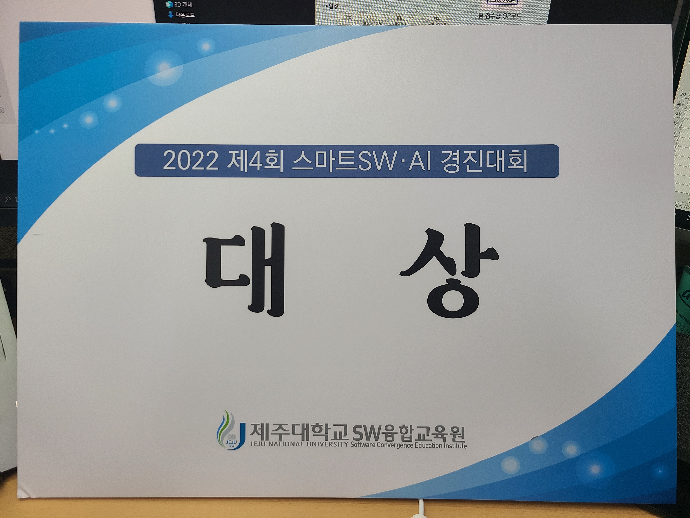
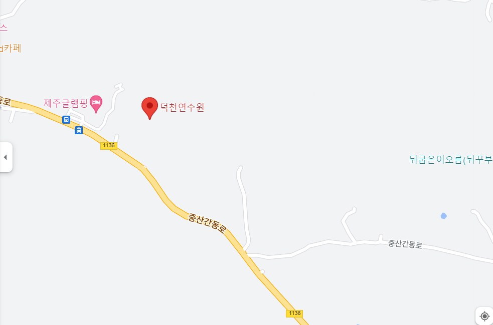
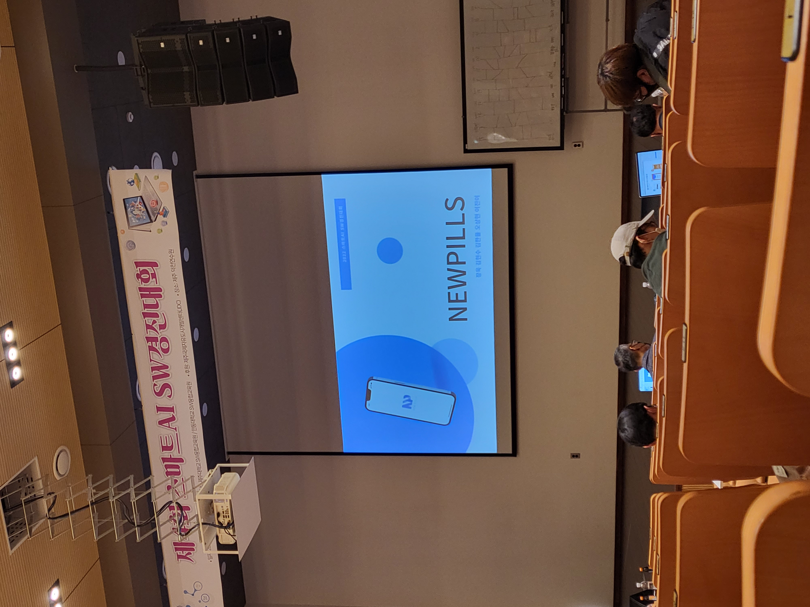
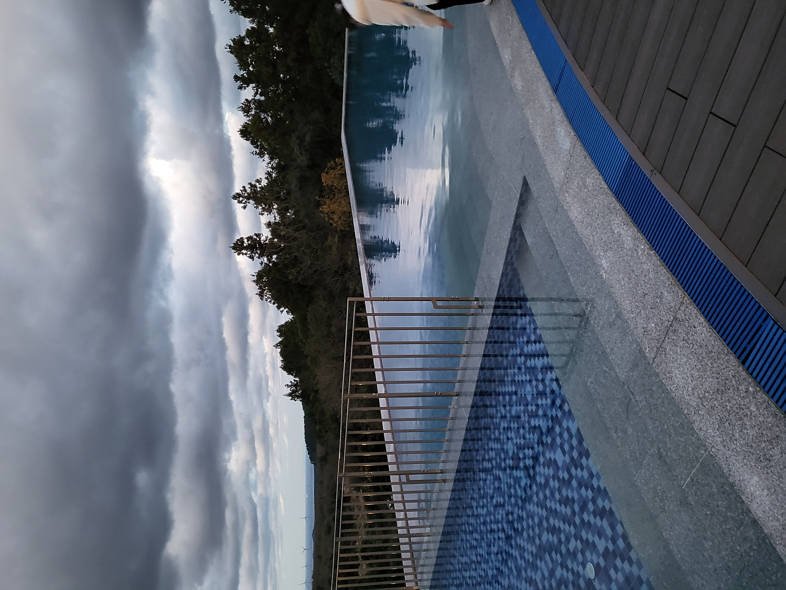
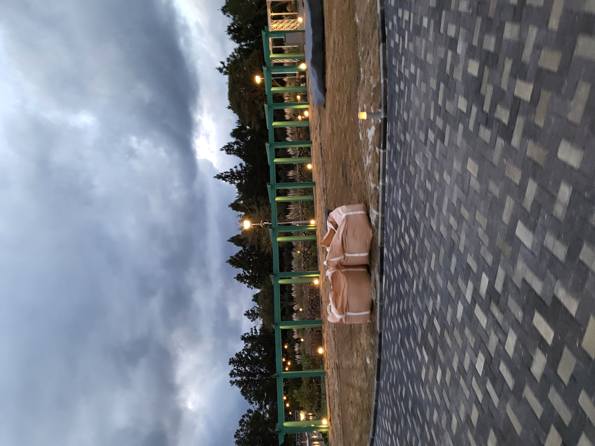

# 제 4회 SW.AI 경진대회 다녀온 후기

### 12월1일 ~ 12월3일

오늘 학교에서 주최하는 대회에 참석하고 왔다.

대상받았다.

------

덕천 연수원에서 3일동안 모르는 사람들과 동거동락하며 시간을 보냈습니다.

덕천 연수원의 밥은 맛은 있지만 메뉴들이 제취향이 아니었습니다.

저는 고추가루로 양념된 고기를 굉장히 싫어하고 김말이도 등등 싫어합니다..

그런데 어묵탕이 제 입맛에 맞지 않아서 굉장히 도망치고 싶었습니다.

하지만 버섯 스파게티는 맛있었습니다. 그리고 파인애플이 진짜로 맛있었어요.

그리고 이 곳의 장소는 굉장히 무섭습니다....

배달음식이 전혀 되지 않아서,,,, 계속 도망치고 싶다는 생각을 했습니다.

첫째날은 강연듣고 그렇게 끝났고

둘째날부터 저희가 만든 프로젝트 소개와 

다른 대학교에서 오신 분들의 프로젝트 소개 받기 였습니다.

 

그러다가 제 남자친구와 비슷한 사람도 봤습니다. 매우 신기하게도 눈빛이 닮아서

유심히 봤습니다........ 신기하네요........

그리고 그분의 프로젝트 설명 굉장히 인상적이고 또 열정이 보였어요

재미있었습니다.

--------

