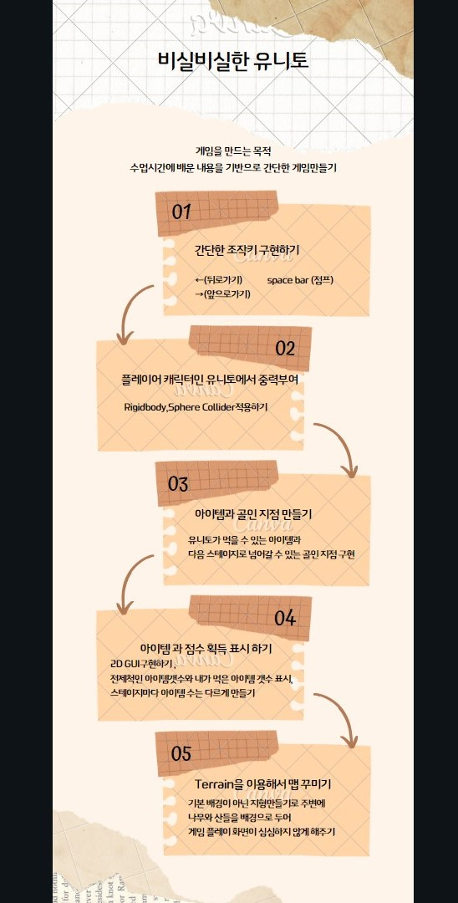
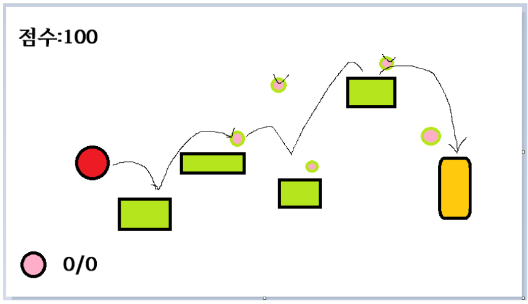
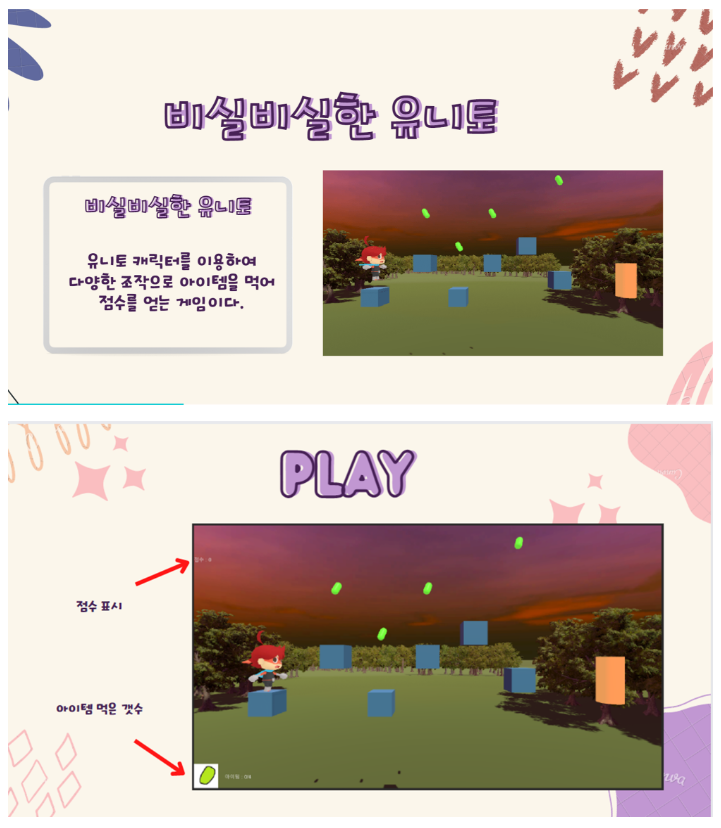

# 유니티 3D 게임 제작 #2

### <비실비실한 유니토>

##### 개요

개발기간:2022.12.05~12.06

게임 엔진: 유니티 / 에디터 버전:2020.3.1f1

템플릿 코어 : 3D

팀원: 1명(김한율)

----------------

##### 게임 시나리오

----------------------

##### 구현결과

###### <플레이 영상>

[]: 

추후 올릴 예정

-----------------------

#### 게임에 대한 분석

###### 게임의 장점

1. 게임이 쉽지않아 재미를 느낄 수 있음
2. 아이템을 먹을 때마다 bgm이 깔려서 아이템 획득을 확인하지 않아도 알 수 있음.
3. 서정적인 배경으로 게임에 아련함을 추가.

###### 게임의 아쉬운 점

1. 유니토가 진짜로 맘대로 움직이지 않음........
2. 유니토가 맘대로 움직이지않아 스테이지 난이도를 굉장히 낮췄음.
3. c#코드와 유니티에 대한 이해도가 낮아 텍스트위치와 폰트가 기본적임

###### 다음에 게임제작할 때 보완할 점

1. 플레이 시간과 플레이 시간에 대한 애니메이션효과 넣어보기
2. 플레이어 캐릭터 조작을 수월하게 바꿔보기
3. 스테이지 더 많이 만들기
4. 빌드하기